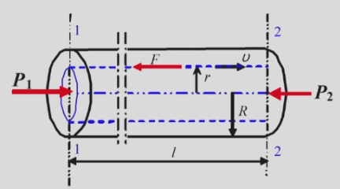
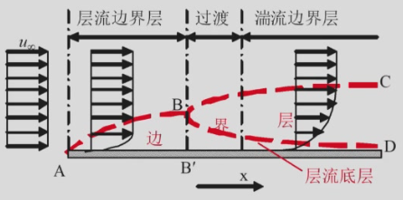

# 第一章 流体流动

## 流体静止的基本方程

### 几个概念

#### 密度

$\rho$，属于物理性质，单位：kg/m$^3$

获得方法：

(1) 查阅物性数据手册

(2) 公式计算：

液体：（要求混合前后总体积近似不变）

$$
\frac{1}{\rho_m} = \frac{a_1}{\rho_1} + \frac{a_2}{\rho_2} + \dots + \frac{a_n}{\rho_n}
$$

气体：

$$
\rho_m = \varphi_1 \rho_1 + \varphi_2 \rho_2 + \dots + \varphi_n \rho_n
$$

#### 静压力（压强）

$p$，属于物理性质，具有各向同性。

国际单位制中单位为：N/m$^2$ = Pa

$$
1 \ \text{atm} = 1.013 \times 10^5 \ \text{Pa} = 760 \ mm \ \text{Hg} = 10.33 \ m \ \text{H}_2\text{O}
$$

压力大小的表征方法：绝压（绝对压力，以绝对真空为基准）、表压（以当地大气压为基准）、真空度（表示负压体系低于当地大气压的压力数值，注意是非负的绝对值）

#### 压缩性

流体分为可压缩流体和不可压缩流体，通常认为液体是不可压缩流体，气体是可压缩流体。但当压力、温度变化均不大时可认为气体也是不可压缩流体。

### 流体静力学方程

#### 推导

在某截面积为 $A$ 的竖直流体中取一段微元 $dz$，它受到上表面向下的压力 $(p+dp)A$，下表面压力 $pA$，重力 $\rho g A dz$，受力平衡有：

$$
pA-(p+dp)A-\rho gAdz = 0
$$

简化为：

$$
dp + \rho g dz = 0
$$

积分得：

$$
p + \rho g z = 常数
$$

因此：

$$
p_2 = p_1 + \rho g(z_1-z_2) \tag{1.1}
$$

即：

$$
\frac{p_2}{\rho g} = \frac{p_1}{\rho g} + (z_1-z_2) \tag{1.2}
$$

工程上，我们称 $\frac{p}{\rho g}$ 为静压头，$z$ 为位头，称方程 (1.1) (1.2) 为流体静力学方程。

#### 讨论

适用范围：重力场中静止、连续、均质、不可压缩的流体。

等高面（水平面）就是等压面，高度越低压力越大。任意平面压力的变化必然引起流体内部各点发生同样大小的变化，即压力的可传递性。（即帕斯卡原理）

**在水平截面上也满足流体静力学方程。**

#### 应用

- 压力测量：

(1) 单管压力计：

取单管内液体密度 $\rho$，液柱高度 $R$，大气压 $p_0$。

$$
p_1 = p_0 + \rho g R
$$

显然，不适用于与大气压相差过大的体系（防止液柱过高），同时不适用于负压体系或气体环境（防止液体流入/气体逸出）。

(2) U 形管压力计：

引入指示剂，取密度为 $\rho_0$，

$$
p_1 + \rho g h = p_0 + \rho_0 g R
$$

可以测液体、气体；可以测负压（也不应差距太大）

- 压差测量：

(1) U 形管压差计：

$$
p_1 + \rho g (z_1 + R) = p_2 + \rho g z_2 + \rho_0 g R
$$

(2) 双液体压差计：

在 U 形管两侧增设两个小室，两种指示液互不相溶、密度差异小。认为小室液面不动。

$$
p_1 + \rho_1 g (z_1 + R) = p_2 + \rho_1 g z_1 + \rho_2 g R
$$

化简得：

$$
p_1 - p_2 = (\rho_2 - \rho_1) g R
$$

通过减小 $(\rho_2-\rho_1)$，可以放大 U 形管的读数，减小误差。

## 流体流动的基本方程

主要研究流体在管路中的流动，遵循三大守恒定律。（本课程不涉及动量守恒）

### 基本概念

#### 稳定流动和不稳定流动

稳定流动要求固定位置上的流动参数（流速、压力、密度等）都不随时间变化，只要有一个参数随时间变化就算不稳定流动（如开工或停工阶段）。

#### 流量和流速

流量分为质量流量（$m_s$，单位 kg/s）和体积流量（$V_s$，单位 m$^3$/s），显然 $m_s = \rho V_s$

流速分为质量流速（$G = m_s/A$）、体积流速（$u = V_s/A = \frac{\iint_A{vdA}}{A}$）和点速度（$v$，单位 m/s），同样有 $G=\rho u$，$m = \rho u A$

#### 黏性与黏度

流体内部存在内摩擦力或黏滞力，气体内摩擦力产生的原因可以从动量传递角度理解，液体的内摩擦力则是由分子间吸引力产生。

剪应力 $\tau$ 表示单位面积上的内摩擦力，单位为 N/m$^2$，公式如下：

$$
\tau = \mu \frac{dv_x}{dy} \tag{1.3}
$$

微分式 $\frac{dv_x}{dy}$ 为速度梯度；方程 (1.3) 称为牛顿黏性定律。

$\mu$ 表示动力黏度，简称黏度，是衡量流体黏性大小的一个物理量，其单位可以通过力与速度梯度的比值获得：

$$
[\mu] = \frac{N/m^2}{(m/s)/m} = Pa \cdot s
$$

常用单位还有泊（$P$），换算为：$1 Pa \cdot s = 10 P = 1000 cP$

黏度是物理性质，获得方式可以由实验测定、手册查阅、经验公式计算。

影响黏度的因素主要有体系、温度、浓度，其中温度升高，液体黏度降低，气体黏度升高。

#### 牛顿型和非牛顿型流体

符合牛顿黏性定律的流体称为牛顿流体（所有气体和大部分低分子量液体或溶液）；非牛顿流体不符合牛顿黏性定律（绝大部分高分子量的流体，如人体血液、淋巴液等多种体液，聚乙烯、聚丙烯酰胺、聚氯乙烯、尼龙66、涤纶、橡胶溶液、各种工程塑料、化纤熔体等）。

### 质量衡算——连续性方程

质量守恒定律——封闭体系中物质质量不变

质量衡算方程——开放体系中，质量守恒定律改为：

（输出控制体的质量流量）-（输入控制体的质量流量）+（控制体内质量随时间的变化率）= 0

对于稳定流动，第三项为 0，所以我们得到输入输出相等。

$$
\rho_1 u_1 A_1 = \rho_2 u_2 A_2
$$

若 $\rho_1 = \rho_2 = const.$，有：

$$
u_1 A_1 = u_2 A_2
$$

即：

$$
u_1 d_1^2 = u_2 d_2^2
$$

对于带分支的管道，取控制体的时候需要包括所有分支，有：

$$
uA = u_1 A_1 + u_2 A_2 + \dots + u_n A_n
$$

### 机械能衡算方程

对于稳定流动的流动系统，（输入的能量速率）=（输出的能量速率），取控制体需要包括所有的进出口（如泵、换热器等等）

#### 流体的能量形式

运动着的流体涉及的能量形式有：内能、动能、位能、压力能、外功、热

- 内能（$U$，J/kg），取决于温度（分子动能、分子间相互作用势能、分子热运动的统计平均动能）；

- 动能（$u^2/2$，J/kg），流体运动的能量；

- 位能（$gz$，J/kg），即势能；

- 压力能（$p/\rho$，J/kg），将流体压入流动系统需要抵抗压力做功；

- 外功（$w_e$），如泵（正功）、水力传动装置（负功）；

- 热（$q_e$），传热，有冷却器、加热器等等，吸热为正。

机械能不考虑内能和热。

> 对压力能，将 1kg 的流体压过某界面，所作功为：$P_1 z_1= (p_1 A_1)(v_1/A_1) = p_1 v_1 = p_1/\rho_1$

#### 理想流体的伯努利方程

理想流体的黏度 $\mu$ = 0

对始末截面 1 和 2，有守恒方程：

$$
gz_1 + \frac{u_1^2}{2} + \frac{p_1}{\rho_1} + w_e = gz_2 + \frac{u_2^2}{2} + \frac{p_2}{\rho_2}
$$

若不考虑外功，$\rho_1 = \rho_2 = \rho$，则化简得：

$$
gz_1 + \frac{u_1^2}{2} + \frac{p_1}{\rho} = gz_2 + \frac{u_2^2}{2} + \frac{p_2}{\rho} \tag{1.4}
$$

方程 (1.4) 是不可压缩理想流体作稳定流动时的机械能衡算方程，称为伯努利方程。

对于没有黏性的流体，流动系统上游的机械能等于下游的机械能。

#### 实际流体的机械能衡算

考虑外功和过程损失，

$$
gz_1 + \frac{u_1^2}{2} + \frac{p_1}{\rho} + w_e = gz_2 + \frac{u_2^2}{2} + \frac{p_2}{\rho} + w_f \tag{1.5}
$$

或改写成：

$$
z_1 + \frac{u_1^2}{2g} + \frac{p_1}{\rho g} + h_e = z_2 + \frac{u_2^2}{2g} + \frac{p_2}{\rho g} + h_f \tag{1.5a}
$$

$$
\rho gz_1 + \frac{\rho u_1^2}{2} + p_1 + \Delta p_e = \rho gz_2 + \frac{\rho u_2^2}{2} + p_2 + \Delta p_f \tag{1.5b}
$$

#### 讨论

适用范围：不可压缩、连续、均质、稳定流动

静止时，$u_1 = u_2 = 0$，可以化简得到流体静力学方程。

若流动系统无外加功，即 $w_e = 0$，则：

$$
Et_1 = Et_2 + w_f
$$

$Et$ 指的是流体自身具有的机械能，由于 $w_f > 0$，所以 $Et_1 > Et_2$，即流体自发从高（机械能）能位流向低（机械能）能位。

**因此涉及流体流向的问题就是求 $Et_1$ 与 $Et_2$ 的大小关系。**

> 使用机械能衡算方程时，应注意以下几点：
> 
> 控制体与控制面的选取：包含待求变量，控制体内流体连续且均质，控制面与流动方向垂直，已知条件尽可能多。
> 
> 基准水平面的选取：一般将基准面定在某一流通截面的中心上。
> 
> 压力：用绝压或表压均可，但两边必须统一，一般用表压更方便，此时与大气接触位置 $p = 0$。

## 流体流动现象

### 流动型态

雷诺实验：用着色水指示管道内水的流动状态，发现当流速较低时，水流呈细线状，质点作直线运动（层流状态）；当流速较高时，水流呈分散状，质点作无规则紊乱运动（湍流状态）。

雷诺数：

$$
Re = \frac{d u \rho}{\mu} = \frac{\rho u^2}{\mu u/d} = \frac{\text{惯性力}}{\text{黏性力}}
$$

惯性力加剧湍动，粘性力抑制湍动。因此根据雷诺数的大小可以判断流动型态：Re $\le$ 2000 为层流，Re $\ge$ 4000 为湍流，2000 < Re < 4000 为过渡区。

$$
[Re] = [\frac{d u \rho}{\mu}] = \frac{m \cdot \frac{m}{s} \cdot \frac{kg}{m^3}}{N \cdot s/m^2} = m^0 kg^0 s^0
$$

可见雷诺数是无量纲数群。

### 湍流的基本概念

在湍流流体中，流体质点的速度大小或方向随时间不断变化，但又围绕某个平均值（时均化）

$$
\overline{v}_x = \frac{1}{t} \int_0^t v_x dt
$$

因此在湍流中任一瞬间的物理量 $A$ 可以表达为时均量 $\overline{A}$ 与脉动量 $A'$ 的和：

$$
A = \overline{A} + A'
$$

### 管内速度分布

{width=50%}

等径管内流动稳定，轴向合力为 0 ，有：

$$
\pi r_1^2 p_1 - \pi r_2^2 p_2 + 2 \pi r l \mu \frac{dv}{dr} = 0
$$

$$
\frac{dv}{dr} = \frac{p_2 - p_1}{2 \mu l} r
$$

考虑初值条件 $v = 0$，$r = R$，有：

$$
\Rightarrow v = \frac{p_2 - p_1}{4 \mu l} (R^2 - r^2)
$$

$$
\Rightarrow v_{max} = \frac{p_2 - p_1}{4 \mu l} R^2, \qquad v = v_{max} (1 - \frac{r^2}{R^2})
$$

$$
\Rightarrow u = \frac{V_s}{A} = \frac{\iint_A v dA}{\pi R^2} = \frac{1}{\pi R^2} \int_0^R v \cdot 2 \pi r dr = \frac{p_2 - p_1}{8 \mu l} R^2 = \frac{\pi R^2}{2} v_{max}
$$

对于湍流，其管内速度分布目前尚不能从理论上导出，只能借助经验公式。

$$
v = v_{max} (1 - \frac{r}{R})^{\frac{1}{n}} \tag{1.6}
$$

式 (1.6) 为一种常用的指数形式的经验式，$n$ 与 Re 大小有关。当 Re 约为 $1.1 \times 10^5$ 时，$n=7$，$u = 0.817 v_{max}$

### 边界层与边界层分离

#### 边界层

在壁面附近，其内部存在速度梯度，一般以速度为主体流速的99%处为划分边界层的界限（$u_x = 0.99 u_{\infty}$）。在离壁面较远处的主体区，速度尚未受到壁面的影响，速度提速几乎为 0 ，可近似视为理想流体。

> 边界层与流动阻力、传热、传质都密切相关。

#### 边界层的形成和发展

{width=30%}

边界层很薄时，边界层内部为层流；随着边界层加厚，边界层内的流动可由层流转变为湍流；其间还有一个过渡区。

在湍流边界层内，由于紧靠壁面处的流体速度仍很小，流动型态保持为层流，称为层流底层。

流动达到充分发展所需的管长称为进口段长度 $L_e$：层流时 $L_e/d = 0.05Re$；湍流时 $L_e = 40 \sim 50 d$。

#### 边界层分离

当流体流过非流线型物体时会发生 **边界层脱离壁面** 的现象，称为边界层分离。

边界层分离虽然在流体输送中应设法避免或减轻，但它对混合及传热、传质又有促进作用，故有时也要加以利用。

## 管内流动的阻力损失

机械能损失 $w_f$ 分为两类：

- 沿程损失（直管损失），来自等径直管

- 局部损失，来自管件或阀门（由于流速大小或方向突然改变，从而产生边界层分离，出现大量漩涡，导致很大的机械能损失）

### 沿程损失的计算通式

机械能衡算公式变形得到：

$$
w_f = \frac{p_1 - p_2}{\rho} + g(z_1 - z_2) = \frac{\Delta p}{\rho} - g h
$$

由受力平衡得：

$$
\pi R^2 \Delta p - \pi R^2 l \rho g \sin \theta - 2 \pi R l \tau_w = 0
$$

$$
\Rightarrow w_f = \frac{\Delta p}{\rho} - g h = \frac{2 \tau_w l}{\rho R} = \frac{4 \tau_w l}{\rho d} = 8 (\frac{\tau_w}{\rho u^2}) (\frac{l}{d}) \frac{u^2}{2}
$$

记 $\lambda = 8 \tau_w / \rho u^2$，

$$
w_f = \lambda \frac{l}{d} \frac{u^2}{2}
$$

#### 层流的摩擦系数

$$
\left\{
\begin{aligned}
v &= v_{max} (1-\frac{r^2}{R^2}) \\
u &= \frac{1}{2} v_{max} \\
\tau_w &= \mu \frac{dv}{dr} \Bigg|_{r=R}
\end{aligned}
\right.
\Rightarrow \tau_w = - \frac{2}{R}\mu v_{max} = - \frac{4}{R}\mu u
$$

$$
\Rightarrow \lambda = \frac{8 \tau_w}{\rho u^2} = \frac{32 \mu}{\rho u R} = \frac{64 \mu}{\rho u d} = \frac{64}{Re}
$$

#### 湍流的摩擦系数

主要依靠实验建立经验关系式，实验在 **量纲分析法** 指导下进行。

以下为量纲分析法的步骤：

(1) 通过实验找到所有影响因素

$$
w_f = f(d, l, i, \rho, \mu, \varepsilon)
$$

(2) 找出各物理量量纲中涉及的基本量纲

$$
[d] = [l] = [\varepsilon] = [m] = L \qquad [u] = [m \cdot s^{-1}] = L \cdot T^{-1}
$$

$$
[\rho] = [kg \cdot m^{-3}] = M \cdot L^{-3} \qquad [\mu] = [Pa \cdot s] = M \cdot L^{-1} \cdot T^{-1}
$$

$$
[w_f] = [J \cdot kg^{-1}] = [(kg \cdot m^2 \cdot s^{-1}) \cdot kg^{-1}] = L^2 \cdot T^{-2}
$$

可见基本量纲个数 $r = 3$

(3) 选择 $r = 3$ 个物理量作为基本物理量

(4) 将其余 $n-r = 7-3 = 4$ 个物理量逐一与基本物理量组成特征数

(5) 根据 **量纲一致性原则** 确定待定指数

最后我们得到：

$$
\frac{w_f}{u^2} = F(Re, \frac{\varepsilon}{d}, \frac{l}{d}) \quad \Rightarrow \quad \lambda = \phi(Re, \varepsilon/d)
$$

$\lambda$, $Re$, $\varepsilon/d$ 三者函数关系的实验结果标绘在双对数坐标图上，称为 **Moody 摩擦系数图** 。