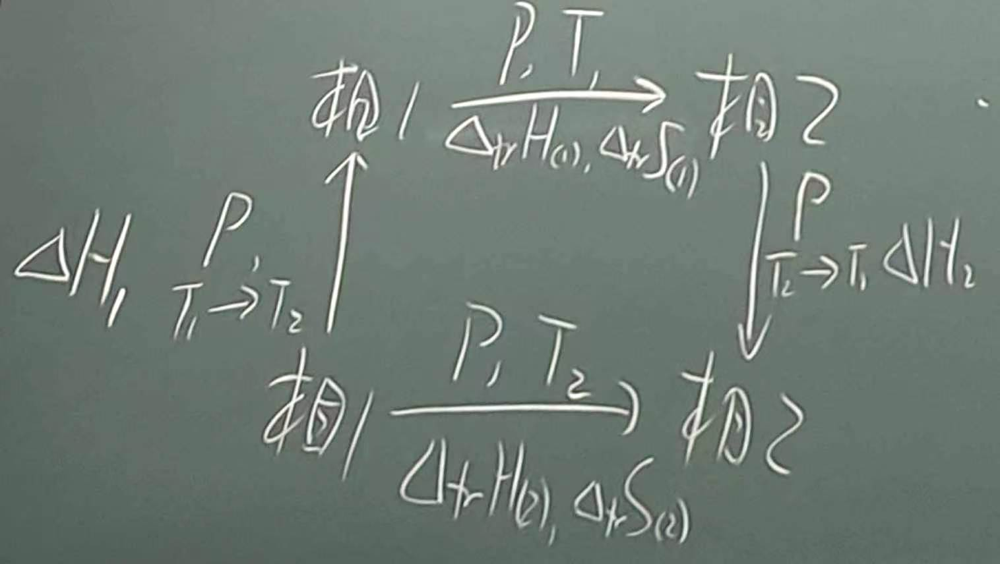

# 第八章：纯物质的体相性质

## 经典气体理论

### 定性模型（实验模型）

- $r_{分子} \ll d_{分子}$

- 无分子间相互作用，弹性碰撞

- 气体分子处于无休止运动

### 定量模型

牛顿定律：单个分子碰撞

$$
p_1 = \frac{F_z}{A} = \frac{2\Delta(m\vec{v})}{A\Delta t}
$$

在 $\Delta t$ 时间内撞击单位面积 $A$ 的分子数 $N_{\Delta t}$：

$$
N_{\Delta t} = \frac{1}{2}\stackrel{-}{v_z}\Delta t A \frac{n N_A}{V}
$$

$$
p = p_1 N_{\Delta t} = \frac{2\Delta(m\vec{v})}{A\Delta t} \cdot \frac{1}{2}\stackrel{-}{v_z}\Delta t A \frac{n N_A}{V}
$$

$$
p = N_A m (\stackrel{-}{v_z})^2 \frac{n}{V} = 2 E_{k,z} \frac{n}{V}
$$

气体动能均分原理：

$$
E_{k,z} = E_{k,x} = E_{k,y} = \frac{1}{3} E_k
$$

## 气体的量子统计热力学

### 理想气体状态方程

$$
p = \frac{\partial A}{\partial V}_{n,T} = nRT(\frac{\partial \ln{\mathscr{f}_{总}}}{\partial V})_{n,T} = nRT(\frac{\partial \ln{V}}{\partial V})_{n,T} = \frac{nRT}{V}
$$

### 定压摩尔热容

$$
C_{p,m} = C_{V,m} + R = \frac{5+F_{转}}{2} R + \sum_{j}{f_j(\mu_1 k_{键})}
$$

- （无机）单原子分子，$C_{p,m} = 2.5R$

- （无机）双原子分子，$C_{p,m} = 3.5R + f(u, k_{键})$

    - 含氢双原子分子，$f \approx 0$

    - 其他共价分子，$\mu \uparrow,\ C_{p,m} \uparrow$，最高到 $4.5R$

    - 活泼的第一主族双原子分子，接近于金属键结合，$k_{键}$ 很小

- （无机）多原子分子

    - H $_n$ X(O, S, N, $\dots$)，$C_{p,m} = 4R + sth.$

- 有机多原子分子

    - 伸缩振动(C-H)可忽略

    - 构象振动

    - 变形振动

    - 重原子效应：重原子取代 H 位置，使得折合质量显然增大。

### 理想气体标准态摩尔熵

标准态定义：

$$
p^{\circ} = 1 \text{bar}, T = 298.15 \text{K}
$$

标准态的理想气体的摩尔体积是一样的，摩尔熵主要由平动贡献，

- 单原子分子

$$
S_{m, 平}^{\circ} = 109 + \frac{3}{2} \ln{M}
$$

$S_{m, 平}^{\circ}$ 的单位是 J/(K $\cdot$ mol)，$M$ 的单位是 g/mol

- 双原子分子的标准态摩尔熵直线比单原子分子大约高 33 J/(K $\cdot$ mol)

- 多原子分子的标准态摩尔熵直线比单原子分子大约高 45 J/(K $\cdot$ mol)

- 有机多原子分子

    - 柔性分子

    以 $S_{m}^{\circ}$ 对分子片段数作图，得到 $y = 162 + 38.4x$

    - 重原子取代同样会导致 $S_{m, 平}^{\circ}$ 升高

### 气体的化学势

纯态：

$$
\mu = G_m = U_m + P V_m - T S_m
$$

以 bar 为气压单位有：

$$
\mu = \mu^\circ + RT \ln{P}
$$

考虑逸度系数 $\gamma$：

$$
\mu = \mu^\circ + RT \ln{\gamma P}
$$

## 纯物质的相变动力学

| 物质 | CsI | CH$_3$(CH$_2$)$_16$CH$_3$ |
| --- | --- | --- |
| m.p. ($^\circ$C) | 700 | 36 |
| $\Delta_{tr}H_m^\circ$ (kJ/mol) | 24 | 68 |

### 相平衡条件

$$
(\frac{\partial G}{\partial \xi})_{T,p} = 0
$$

(1) 定义相变 $G$，

$$
\Delta_{tr} G \equiv (\frac{\partial G}{\partial \xi})_{T,p}
$$

- 与摩尔数无关

- 是状态函数

- 绝大多数情况下，$G \ne \Delta_{tr}G$

(2) 

$$
G = n_1 G_{m1} + n_2 G_{m2}
$$

(3) 

$$
d\xi = dn_2 = -dn_1
$$

$$
dG_m = -S_m dT + V_m dp = 0
$$

$$
\therefore (\frac{\partial G}{\partial \xi})_{T,p} = (\frac{\partial (n_1 G_{m1} + n_2 G_{m2})}{\partial \xi})_{T,p} = G_{m2} - G_{m1} = \mu_2 - \mu_1
$$

状态函数，$T$、$p$ 给定有定值，是强度性质。

$$
\Delta_{tr} G = \Delta_{tr} H - T_{tr} \Delta_{tr} S
$$

平衡要求，

$$
\Delta_{tr} G_{平衡} = \Delta_{tr} H_{平衡} - T_{tr} \Delta_{tr} S_{平衡} = 0, \qquad (\frac{\partial G}{\partial \xi})_{T,p(平衡)} = \mu_2 - \mu_1 = 0, \quad \mu_1 = \mu_2
$$

我们主要研究标准态下的情况，实际考虑：

$$
\Delta_{tr} G_{平}^{\circ} = \Delta_{tr} H_{平(b.p.)}^{\circ} - T_{b.p.} \Delta_{tr} S_{平(b.p.)}^{\circ}
$$

实验数据一般是在 $p = 1 \text{bar}$、$T = 298.15 \text{K} \text{或} T_{tr}$ 的条件下测定。

### 热力学(相变)数据计算

$$
\begin{aligned}
\Delta_{tr} H_{(2)} &= \Delta H_1 + \Delta_{tr} H_{(1)} + \Delta H_2 \\
&= \Delta_{tr} H_{(1)} + \int_{T_1}^{T_2} C_{p,m1}dT + \int_{T_1}^{T_2} C_{p,m2}dT \\
&= \Delta_{tr} H_{(1)} + \int_{T_1}^{T_2} \Delta(C_{p,m})dT
\end{aligned}
$$

$$
\Delta_{tr} S_{(2)} = \Delta_{tr} S_{(1)} + \int_{T_1}^{T_2} [\Delta(C_{p,m})/T]dT
$$

对于生发，$T_1 \sim T_2$ 改变不太大，$\Delta(C_{p,m}) \approx$ 常数

### 纯物质的相图

